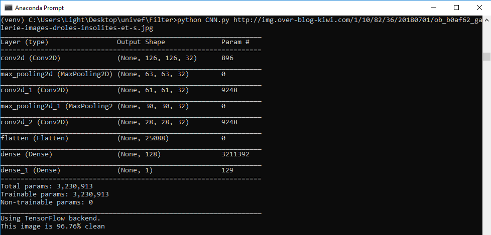

# Image-Classification
 Application of Convolutional Neural Networks (ConvNet) for image classification allowing the detection of inappropriate images.
This program classifies images using a Convolutional Neural Network (CNN). The images are preprocessed and normalized then used to train a CNN consisting of convolutional, max pooling, dropout, fully connected, and output layers.

In this project there is no training and the parameters are loaded from an existing model

 # Install
* Python 3.7
  * I recommend installing Anaconda as it is alreay set up for machine learning
  * If unfamiliar with the command line there are graphical installs for macOS, Windows, and Linux
* TensorFlow

 # How to use it
* If not using Anaconda
  * Open Command line:   Start menu -> Run  and type cmd
* If using Anaconda
  * Open Command line:   Start menu -> Anaconda Prompt
* Go to the folder where the script is downloaded using 'cd'
* Type:  >python ./CNN.py url
 # Example
 Let's try this image
 
 
 > URL is 'http://img.over-blog-kiwi.com/1/10/82/36/20180701/ob_b0af62_galerie-images-droles-insolites-et-s.jpg'
 ###### Command Line
 ```
 >python CNN.py http://img.over-blog-kiwi.com/1/10/82/36/20180701/ob_b0af62_galerie-images-droles-insolites-et-s.jpg
 ```
  ### Output
  
  
